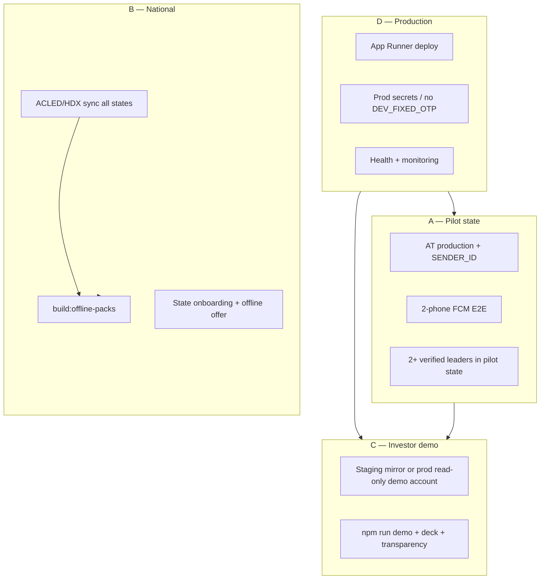

# SafeAlert NG — Unified Launch Design (Pilot + National + Demo + Production)

**Date:** 2026-06-06  
**Status:** Approved — implementation in progress (see plan)  
**Scope:** All four 30-day goals in parallel:
- **A** One-state pilot (real SMS + push on phones)
- **B** National presence (37 states)
- **C** Investor demo polish (staging + scripted flows)
- **D** Production deploy (App Runner + Firebase/AT)

**Builds on:** [2026-06-05 national launch design](./2026-06-05-safealert-national-launch-design.md)

---

## 1. Executive summary

SafeAlert’s **codebase is launch-capable**; “function properly” now means **operational closure** on four tracks that run in parallel, not a single sequential build.

| Track | What “done” looks like in 30 days |
|-------|-----------------------------------|
| **Pilot (A)** | Lagos (or FCT) corridor: real circle SMS, 2-phone FCM help-nearby E2E, ≥50 active zones in pilot state |
| **National (B)** | 37/37 states in config + polygons; offline packs rebuilt; ACLED/HDX seed; thin maps OK outside pilot |
| **Demo (C)** | Staging URL + `npm run demo` green; one-pager traction from `/v1/transparency`; 5-min script rehearsed |
| **Production (D)** | App Runner live, prod `.env` (no `DEV_FIXED_OTP`), Firestore, health `database: firestore`, CI green |

**Recommended approach:** **Hub-and-spoke** — production deploy (D) and demo staging (C) first; pilot (A) validates delivery on prod; national (B) is data/onboarding breadth without blocking pilot depth.

---

## 2. Current state (2026-06-06)

### Already shipped (do not rebuild)

- 37 states + FCT in `nigeriaStates.json`; exact ADM1 polygons (`nigeriaStatePolygons.json`)
- Web PWA split into `public/js/app/*` (17 modules)
- Admin moderation + runtime proximity kill switch (`ADMIN_SECRET`, `app_settings/global`)
- Durable notify jobs + optional Pub/Sub (`NOTIFY_PUBSUB_*`, `npm run notify:worker`)
- Flutter: FCM wiring, i18n expansion, icon-only + voice modes
- Tests: 54 Jest + 26 smoke; investor demo script (`npm run demo`)
- Firebase Admin + Web FCM keys in `.env`; Firestore (`USE_MEMORY_DB=false`)

### Still blocking “functions properly”

| Gap | Impact | Owner track |
|-----|--------|-------------|
| `DEV_FIXED_OTP` in prod `.env` | Insecure OTP; launch check warns | D |
| AT **sandbox** + empty `AT_SENDER_ID` | Circle panic SMS not real | A, D |
| Offline packs often **0 zones** | Empty downloads outside Firestore | B |
| FCM E2E not proven on 2 physical devices | “Push works” is theoretical | A |
| Flutter missing `google-services.json` / plist | Native push not production | A |
| WhatsApp env unset | Bot inactive | B (P2) |
| Pub/Sub not enabled in GCP | Single-process notify only | D (defer until load) |

---

## 3. Architecture — four parallel workstreams

### Workstream A — Pilot state (depth)

**Default pilot:** **Lagos** (density, investor familiarity). Alternate: **FCT** (gov/corporate demos).

| Task | Detail | Exit |
|------|--------|------|
| A1 | Africa's Talking **production** username + approved `AT_SENDER_ID` | OTP + circle SMS to any NG number |
| A2 | Remove `DEV_FIXED_OTP` on **production**; keep on **staging** only | `launch:check` no OTP warn on prod |
| A3 | 2-phone test: User A panic → User B (help_nearby + FCM) gets push | Screenshot + log `sent > 0` not `mock` |
| A4 | Flutter internal build with `google-services.json` | Same FCM test on Android |
| A5 | Recruit 2 verified community leaders in pilot state | Admin verify flow used |
| A6 | Target ≥50 active zones in pilot state (ACLED + community) | Transparency shows pilot state in top_states |

### Workstream B — National (breadth)

| Task | Detail | Exit |
|------|--------|------|
| B1 | Run `npm run sync:acled` + `sync:hdx` against prod Firestore | `zones.by_source.acled_and_hdx > 0` |
| B2 | `npm run build:offline-packs` after sync | Each pack `zone_count > 0` OR explicit `source: static_fallback` |
| B3 | Onboarding offers home-state pack (web + Flutter) | Download works offline in 3 random states |
| B4 | Per-state radio bulletin API smoke for 6 geo zones | Hausa/Yoruba/Igbo copy live |
| B5 | Marketing: national PWA URL, not Lagos-only | Ads land on `/app/` with state picker |

**Principle:** National **presence** ≠ equal density. Cold states show ACLED seed + “Be the first reporter” CTA.

### Workstream C — Investor demo (polish)

| Task | Detail | Exit |
|------|--------|------|
| C1 | **Staging** subdomain OR prod with isolated demo account | `npm run demo https://staging…` all green |
| C2 | Fill one-pager traction from live `GET /v1/transparency` | No `[fill]` placeholders |
| C3 | Rehearse `docs/fundraise/demo-script.md` ≤5 min | Hook → map → report → confirm → panic → transparency |
| C4 | Record 30s screen capture (`public/marketing/export/`) | Optional backup if live SMS fails |
| C5 | Admin proximity kill switch demo for ops story | Toggle off → health reflects in <15s |

**OTP fallback:** Staging keeps `EXPOSE_SANDBOX_OTP=true`; prod demo uses pre-authenticated JWT or whitelisted test phones.

### Workstream D — Production deploy

| Task | Detail | Exit |
|------|--------|------|
| D1 | App Runner deploy from `scripts/aws/deploy-apprunner.sh` | Public HTTPS URL |
| D2 | Prod env in AWS Secrets / SSM — not committed `.env` | `validate-env` with `NODE_ENV=production` |
| D3 | `USE_MEMORY_DB=false`, `SEED_REVIEW_DATA=false` | Health `database: firestore` |
| D4 | Firestore rules + indexes deployed | `firebase deploy --only firestore:rules,firestore:indexes` |
| D5 | CI on main: test + smoke + launch:check (staging) | Green badge |
| D6 | Uptime check on `/v1/health?deep=1` | Pager/email on degraded |

---

## 4. Environment strategy (critical for “all four”)

Use **three tiers**:

| Tier | Purpose | Key env differences |
|------|---------|---------------------|
| **Local** | Dev | `DEV_FIXED_OTP`, sandbox AT, optional memory DB |
| **Staging** | Demo + QA | Firestore (separate project or prefix), sandbox OTP exposed, `ADMIN_SECRET` |
| **Production** | Pilot + national users | No fixed OTP, AT production + sender ID, real secrets |

Never run investor demo against prod with `DEV_FIXED_OTP` enabled.

---

## 5. 30-day calendar (parallel)

### Week 1 — Deploy + data foundation

| Day | D | C | A | B |
|-----|---|---|---|---|
| 1–2 | App Runner deploy, prod secrets | Point demo script at staging URL | Apply for AT sender ID | ACLED/HDX sync to Firestore |
| 3–4 | Firestore rules/indexes | `npm run demo` on staging | — | `build:offline-packs` |
| 5–7 | Health monitoring | Fill one-pager metrics | 2-phone FCM test (web) | Verify 37 packs non-empty |

### Week 2 — Pilot proof + demo rehearsal

| Day | D | C | A | B |
|-----|---|---|---|---|
| 8–10 | Rate limit tune on prod | Dry-run demo 3× | Real SMS circle panic test | Leader recruitment pilot state |
| 11–12 | — | Record backup video | Flutter FCM test | Trust screen state leaders |
| 13–14 | Launch check on prod | Investor dry-run with founder | ≥50 zones Lagos | National ads soft launch |

### Week 3–4 — Scale signals + fundraise

- Pub/Sub workers **only if** panic queue latency >15s p95
- WhatsApp bot if Meta app approved
- Transparency weekly email to investors
- Target: 500+ MAU national, 50+ pilot-state active users

---

## 6. Success metrics (all four goals)

| Goal | Metric | 30-day target |
|------|--------|---------------|
| A Pilot | Circle SMS delivery rate (prod) | >95% to valid NG numbers |
| A Pilot | FCM nearby panic (opted-in) | ≥1 successful E2E per week |
| B National | States with ≥1 zone | 37/37 |
| B National | Offline packs with data | 37/37 |
| C Demo | Automated demo pass rate | 100% on staging |
| C Demo | Live demo without OTP failure | 2 consecutive rehearsals |
| D Prod | Uptime | >99.5% |
| D Prod | `launch:check --production` | PASS (no FAIL) |

---

## 7. Approaches considered

### Option 1 — Hub-and-spoke (recommended)

Deploy prod early; pilot depth in one state; national breadth via data sync; demo on staging.

**Pros:** Fastest path to real SMS/push proof + investor URL.  
**Cons:** Ops overhead (3 env tiers).

### Option 2 — Sequential (national first, then pilot)

Fill all 37 states before AT production.

**Pros:** Simpler story for “national launch.”  
**Cons:** Delays real SMS/push proof; investor demo stays sandbox longer.

### Option 3 — Demo-first (staging only, defer prod)

Perfect demo; deploy later.

**Pros:** Low risk for fundraise meetings.  
**Cons:** No real user traction; metrics stay thin.

**Decision:** Option 1 — matches “all of them” without blocking any track.

---

## 8. Out of scope (30 days)

- NCC USSD shortcode (₦500K–2M+)
- WhatsApp bot (unless Meta app already approved)
- Pub/Sub multi-worker (unless load requires)
- App Store / Play Store public listing (internal APK/TestFlight OK)
- OpenAI paid insights

---

## 9. Risks

| Risk | Mitigation |
|------|------------|
| AT sender ID approval slow | Pilot demo with whitelisted phones; video backup |
| Sparse maps outside Lagos | ACLED seed + offline packs + “first reporter” UX |
| FCM permission denial | Demo script emphasizes circle SMS; helper device pre-configured |
| Firestore cost spike | `BUDGET_MODE=true`, data saver default, location throttle |
| Panic abuse | Rate limits + cooldown (already in API) |

---

## 10. Next step after approval

Invoke **writing-plans** skill → `docs/superpowers/plans/2026-06-06-safealert-unified-launch.md` with bite-sized tasks per workstream (A/B/C/D), owners, and verification commands.

No implementation until plan is approved.
